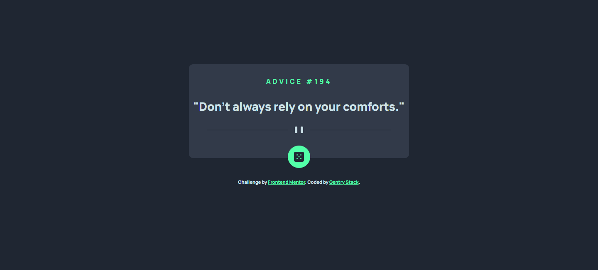
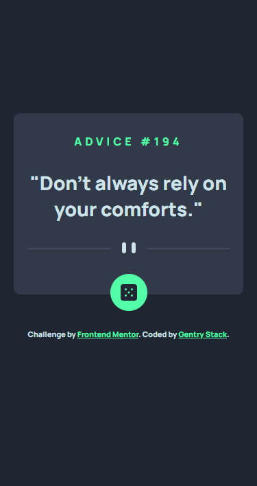

# Frontend Mentor - Advice generator app solution

This is a solution to the [Advice generator app challenge on Frontend Mentor](https://www.frontendmentor.io/challenges/advice-generator-app-QdUG-13db) by [Afolabi John - Gentry](https://gentry.com.ng/). 

## Table of contents

- [Overview](#overview)
  - [The challenge](#the-challenge)
  - [Screenshot](#screenshot)
  - [Links](#links)
- [My process](#my-process)
  - [Built with](#built-with)
  - [What I learned](#what-i-learned)
  - [Continued development](#continued-development)
  - [Useful resources](#useful-resources)
- [Author](#author)
- [Acknowledgments](#acknowledgments)

## Overview

### The challenge

Users should be able to:

- View the optimal layout for the app depending on their device's screen size
- See hover states for all interactive elements on the page
- Generate a new piece of advice by clicking the dice icon

### Screenshot

- Desktop View

- Mobile View

### Links

- Solution URL: [GitHub Repo Link](https://your-solution-url.com)
- Live Site URL: [Link to live site](https://your-live-site-url.com)

## My process

### Built with

- Semantic HTML5 markup
- CSS custom properties
- Flexbox
- CSS Grid
- Mobile-first workflow
- SCSS/SASS
- Advice slip API

### What I learned

- My first time working with APIs, async functions and JSON. I learnt how to use the fetch function, work with API: paths, parameters, endpoints and a lot.

- It was really fun,I enjoyed the process of building this web app.

- I had some unexpected hiccup in the CSS positioning. Although my grip on these is really strong, I still encountered some challenges which made me went back learning and it was really great.

### Continued development

- I'm planning on making this full-stack by building my own server to send request and all.
- Would also like to add more features like search, get advice by Id.

### Useful resources

- [Coding train playlist on Data and API](https://youtu.be/DbcLg8nRWEg) - This helped me understand how to work with APIs, Datas like CSV,JSON and lot more.
- [Advice Slip API](https://api.adviceslip.com) - This is the amazing website for the Advice slip API docs.

## Author

- Website - [Gentry Stack](https://www.gentry.com.ng)
- Frontend Mentor - [@GentryHQ](https://www.frontendmentor.io/profile/GentryHQ)
- Twitter - [@iam_gentry](https://www.twitter.com/iam_gentry)

## Acknowledgments

Thank you for checking me out.
